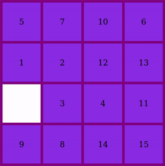

  

  
  
    
  

### Hi there 👋 I am Luis
I am a ✨Full-Stack Developer✨ and ✨Computer Science Student✨

### 🔭 I’m currently working on
  - Web Development (Full-Stack)
  - DevOps

### 🌱 I’m currently learning
  - Data Science
  - Computer Vision
  - REST APIs

### :hammer_and_wrench: Languages and Tools :

  &nbsp;
  &nbsp;
  &nbsp;
  &nbsp;
  &nbsp;
  &nbsp;
  &nbsp;
  &nbsp;
  &nbsp;
  &nbsp;
  &nbsp;
  &nbsp;

 

  

<!--
**Luisill0/Luisill0** is a ✨ _special_ ✨ repository because its `README.md` (this file) appears on your GitHub profile.

Here are some ideas to get you started:

- 🔭 I’m currently working on ...
- 🌱 I’m currently learning ...
- 👯 I’m looking to collaborate on ...
- 🤔 I’m looking for help with ...
- 💬 Ask me about ...
- 📫 How to reach me: ...
- 😄 Pronouns: ...
- ⚡ Fun fact: ...

### Check out my favorite projects!

  
  <h3>15 Puzzle with vanilla JavaScript</h3>

-->
